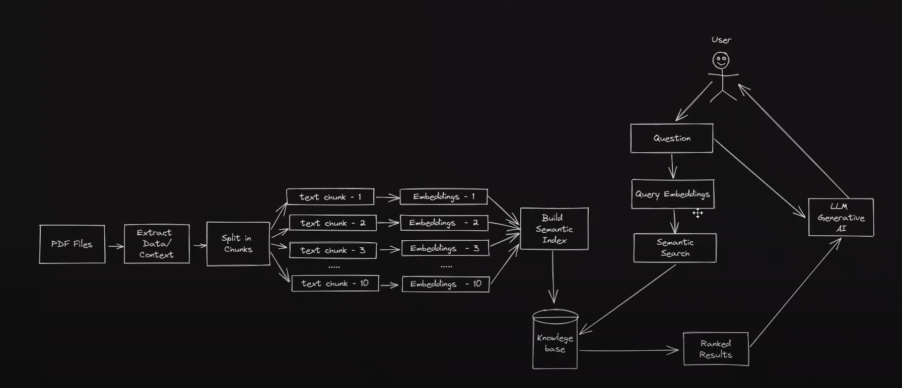
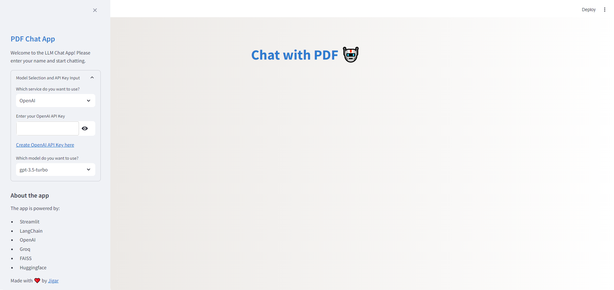
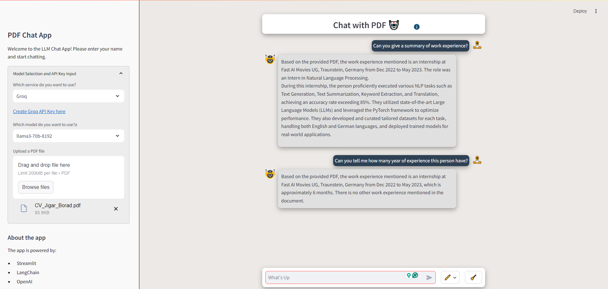

# PDF Chat App 🤖

Welcome to the LLM Chat App, a powerful and interactive web application that allows you to chat with a Language Model (LLM) and ask questions about the content of uploaded PDF files. The app leverages the capabilities of Streamlit, LangChain, OpenAI, Groq, and FAISS to provide an intuitive and user-friendly experience.

**Access this app using the following web address:**
- [PDF Chat RAG Application](https://llmchatrag.streamlit.app/)
    - ⚠️ Note: We do not save your secret key anywhere, so it's safe to enter your key.

## Features ✨

- **Upload PDFs:** Easily upload your PDF documents for processing.
- **Interactive Chat:** Ask questions related to the content of the uploaded PDF with text input and microphone and get responses from an LLM.
- **Text Extraction and Chunking:** Extract text from PDFs and split it into manageable chunks for efficient processing.
- **Vector Store:** Utilize FAISS to create and manage vector stores for fast similarity searches.
- **Custom CSS:** Enjoy a modern and visually appealing interface with a custom-designed CSS.
- **Support for Multiple Models:** Choose between OpenAI and Groq models based on your preference and API key.
- **Groq Models:** Currently free to use.
- **Custom Instructions:** One give customs instruction(prompts) if not satisfied with default.
- **Embeddings:** Use HuggingFace embeddings for Groq models and OpenAI embeddings for OpenAI models.

## Technologies Used

- **Streamlit:** For building the interactive web application.
- **LangChain:** For managing text processing and language model interactions.
- **OpenAI:** Powering the language model to understand and respond to user queries.
- **Groq:** Alternative LLM for text queries, currently free to use.
- **FAISS:** Efficient vector search for handling large text data.
- **HuggingFace:** Providing embeddings for Groq models.
- **OpenAI Embeddings:** Used for OpenAI models.
- **SpeechRecognition:** Used to take input from microphone
- **Chime:** For notification sound

## Available Models

### OpenAI Models
- **gpt-3.5-turbo**

### Groq Models
- **llama3-70b-8192**
- **mixtral-8x7b-32768**
- **llama3-8b-8192**

## Usage
⚠️ **Please refer to the [Installation instructions](#installation) below before directly running the app.**
1. **Run the Streamlit App:**
   ```sh
   streamlit run app.py
   ```
2. **Enter API Key:**
    - If you are running the code for the first time, enter your OpenAI or Groq API key.
    - The key will be saved in the session state and you won't need to enter it again.

3. **Upload a PDF:**
   - Click on "Upload a PDF file" and select a PDF from your local machine.
   - The app will extract and process the text from the PDF.

4. **Give custom instructions(Optional)**
   - Click on the Custom instruction
   - If custom instruction hasa been give Chatbot will follow that otherwise default instruction will be followed.

5. **Ask Questions:**
   - Enter your question in the text input field.
   - The app will perform a similarity search on the PDF content and provide an answer based on the relevant text.

6. **Clear the History:**
    - Click on the broom (clear the history) button

7. **Change the models:**
    - Click on the models available on the sidebar to change the models
    - Enter Apis if asked.

8. **Use microphone as input:**
    - Click on mic button to give input from mic instead of writing it (Only available for Groq models)

## Screenshots
**Workflow of RAG**


**The home screen of the LLM Chat App.**


**Interactive chat interface to ask questions about the PDF content.**



---

## Inspiration and Sources

This project draws inspiration from and references the following sources:
- [Prompt Engineering YouTube Tutorial](https://www.youtube.com/watch?v=RIWbalZ7sTo&t=509s&ab_channel=PromptEngineering): This tutorial provided guidance on building interactive chat applications with language models using Streamlit and Python.

And of course, couldn't have done it without the wisdom imparted by ChatGPT 🙄.

## Custom CSS

The app includes custom CSS for a complete redesign, ensuring a modern and user-friendly interface. The styles are defined within the `styles.py` file and applied in `app.py`.

## Installation

1. **Clone the Repository:**
   ```sh
   git clone https://github.com/jigarborad/llm-chat-app.git
   cd llm-chat-app
   ```
2. **Create and Activate the Virtual Environment:**

    Open a terminal or command prompt, navigate to your project directory, and execute the following command to create a virtual environment named `venv`:

    ```bash
    python -m venv venv
    ```

    or

    ```bash
    conda create --name venv
    ```

    After creating the virtual environment, activate it using the appropriate command for your operating system:

    - **Windows:**
        ```bash
        venv\Scripts\activate
        ```

    - **Unix or MacOS:**
        ```bash
        source venv/bin/activate
        ```

        or 

    - **conda:**
        ```bash
        conda activate venv
        ```

    Once activated, you should see `(venv)` prefixed before your command prompt. This indicates that you are now operating within the virtual environment.

3. **Install the Required Packages:**
   ```sh
   pip install -r requirements.txt
   ```

## About

This app was developed with ❤️ by [Jigar](https://github.com/jigarborad).

## Contributing

Contributions are welcome! If you have any suggestions, bug reports, or feature requests, please open an issue or submit a pull request.

## License

This project is licensed under the MIT License.

---

Enjoy using the LLM Chat App! If you have any questions or need further assistance, feel free to reach out. Happy chatting! 🤖
