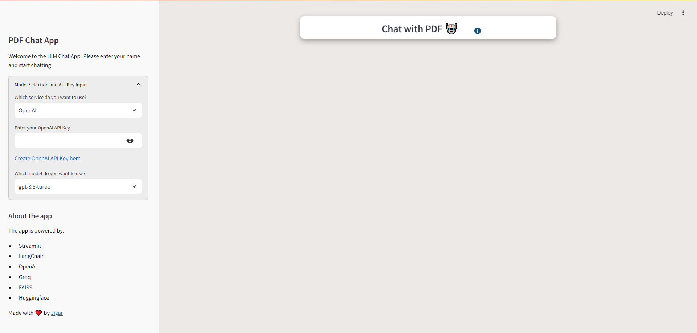

# LLM Chat App 🤖

Welcome to the LLM Chat App, a powerful and interactive web application that allows you to chat with a Language Model (LLM) and ask questions about the content of uploaded PDF files. The app leverages the capabilities of Streamlit, LangChain, OpenAI, and FAISS to provide an intuitive and user-friendly experience.

**Access this app using following web address**
- [LLM Chat Ragg applictaion](https://llmchatrag.streamlit.app/)
    - ⚠️ Note: We do not save your secret key anywhere so its safe to enter your key
## Features ✨

- **Upload PDFs:** Easily upload your PDF documents for processing.
- **Interactive Chat:** Ask questions related to the content of the uploaded PDF and get responses from an LLM.
- **Text Extraction and Chunking:** Extract text from PDFs and split it into manageable chunks for efficient processing.
- **Vector Store:** Utilize FAISS to create and manage vector stores for fast similarity searches.
- **Custom CSS:** Enjoy a modern and visually appealing interface with a custom-designed CSS.

## Technologies Used

- **Streamlit:** For building the interactive web application.
- **LangChain:** For managing text processing and language model interactions.
- **OpenAI:** Powering the language model to understand and respond to user queries.
- **FAISS:** Efficient vector search for handling large text data.

## Usage
⚠️ **Please refer to the [Installation instructions](#installation) below before directly running the app.**
1. **Run the Streamlit App:**
   ```sh
   streamlit run app.py
   ```
2. **Enter Open AI Key:**
    - If you are running the code for the first time, enter your Open AI key.
    - The key will be saved in the .env file and you won't need to enter it again.

3. **Upload a PDF:**
   - Click on "Upload a PDF file" and select a PDF from your local machine.
   - The app will extract and process the text from the PDF.

4. **Ask Questions:**
   - Enter your question in the text input field.
   - The app will perform a similarity search on the PDF content and provide an answer based on the relevant text.

## Screenshots
**Workflow of RAG**


**The home screen of the LLM Chat App.**



**Uploading a PDF file for processing.**


**Interactive chat interface to ask questions about the PDF content.**


## Custom CSS

The app includes custom CSS for a complete redesign, ensuring a modern and user-friendly interface. The styles are defined within the `st.markdown` call in the `app.py` file.

## Installation

1. **Clone the Repository:**
   ```sh
   git clone https://github.com/jigarborad/llm-chat-app.git
   cd llm-chat-app
   ```
2. **Create and activate the Virtual Environment:**

    Open a terminal or command prompt, navigate to your project directory, and execute the following command to create a virtual environment named `venv`:

    ```bash
    python -m venv venv
    ```

    or

    ```bash
    conda create --name venv
    ```

    After creating the virtual environment, activate it using the appropriate command for your operating system:

    - **Windows:**
        ```bash
        venv\Scripts\activate
        ```

    - **Unix or MacOS:**
        ```bash
        source venv/bin/activate
        ```

        or 

    - **conda:**
        ```bash
        conda activate venv
        ```


    Once activated, you should see `(venv)` prefixed before your command prompt. This indicates that you are now operating within the virtual environment.

## About

This app was developed with ❤️ by [Jigar](https://github.com/jigarborad).

## Contributing

Contributions are welcome! If you have any suggestions, bug reports, or feature requests, please open an issue or submit a pull request.

## License

This project is licensed under the MIT License.

---

Enjoy using the LLM Chat App! If you have any questions or need further assistance, feel free to reach out. Happy chatting! 🤖
